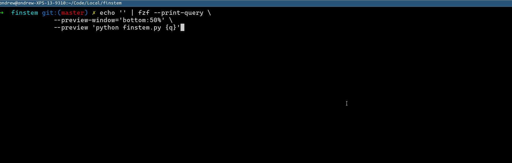

# finstem - simple tool for command-line Finnish stemming


## Quickstart

### On Ubuntu 22.04

_Tested on a **totally fresh** Vagrant install of Ubuntu 22.04. You probably already have some or all of these installed._

```bash
# Install the prerequisites
sudo apt update
sudo apt install pip python-is-python3
sudo apt -y install -y voikko-fi python-libvoikko
pip install click

# clone the repo and run the command!
git clone https://github.com/hiAndrewQuinn/finstem
cd finstem

python finstem.py --help
python finstem.py 'kissa' 'kissat' 'anteeksi' 'peter'
```

## Advanced

### Passing a list of words in a text file

```bash
echo 'sana' > words.txt
echo 'vaimonille' >> words.txt
echo 'kirjoja' >> words.txt

# Pass each line as an argument to finstem.py
cat words.txt | xargs -n 1 python finstem.py
```


### Interactive mode

_Requires [fzf](https://github.com/junegunn/fzf)._

```bash
echo '' | fzf --print-query \
   --preview-window='bottom:50%' \
   --preview 'python finstem.py {q}'
```


